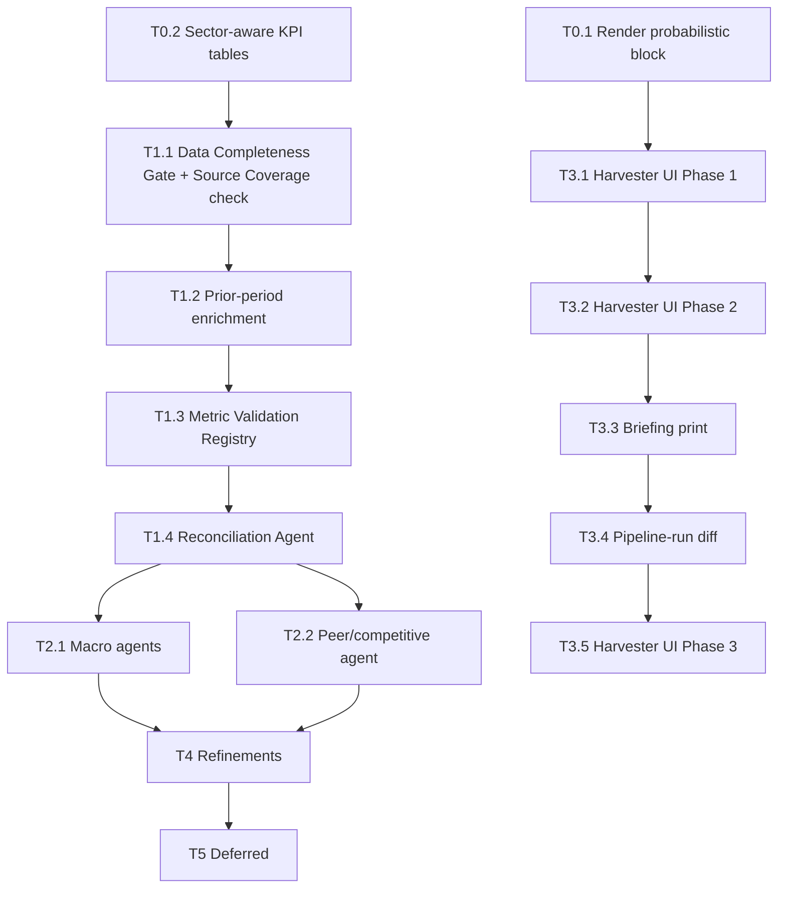

# Consolidated Roadmap — 2026-04-19

## Context

Six planning docs were drifting in parallel:

1. `1_agent-architecture-clean-break.md` — big architecture doc (tiers, sprints, ingestion agents)
2. `2_pipeline_improvements.md` — 8 failure modes from the Ally Q1/Q2/Q3 post-mortems
3. `3_Merge from other tool.md` — features from the old `oldfield-research-export` app worth porting
4. `sharded-hugging-clock.md` — harvester UI redesign (12 items in 3 phases)
5. `bubbly-juggling-sphinx.md` — render probabilistic output block in Results tab
6. `eager-giggling-sunset.md` — sector-aware KPI table detection (banks/insurance)

This document merges them into a single priority-ordered roadmap so you can work top-down from one list. It does **not** replace the individual docs — they remain the detailed specs. When a tier item has an owning doc, the doc is cited inline.

---

## Status snapshot (as of 2026-04-19)

Taken from `1_agent-architecture-clean-break.md` status table plus `CLAUDE.md` agent-architecture section, cross-checked against the repo.

**Shipped ✅**
- Agent foundation: `agents/base.py`, `agents/registry.py`, `agents/orchestrator.py`, DB tables (`agent_outputs`, `pipeline_runs`, `agent_calibration`, `context_contracts`).
- Analysis agents: `financial_analyst`, `bear_case`, `bull_case`, `debate_agent`, `quality_control`.
- Ingestion-time deep reads (transcript, presentation, annual report) wired into `services/background_processor._analyse_document_with_llm()`.
- Specialist: `guidance_tracker`.
- Ingestion layer: `orchestrator`, `document_triage`, `coverage_monitor` (learned cadence + auto-rescan). Tables `ingestion_triage`, `coverage_rescan_log` live.
- Parity: `/harvester/coverage-compare` + weekly Teams Parity line.

**Partial 🟡**
- `broker_note_synthesis` prompt deferred (may skip entirely).
- `context_builder.py` and `background_processor.py` are NOT deletable (load-bearing) — the "everything deletable" assertion in doc 1 §8 was aspirational. **Decision: keep both.**

**Not started ❌**
- Macro agents (`macro_regime`, `rates_duration`) — biggest content gap; Bear/Bull prompts accept `context_contract` input but no agent produces it.
- Portfolio agents (`factor_exposure`, `concentration`).
- `event_scanner`, `source_quality` ingestion agents (table `source_quality` missing).
- Calibration worker.
- Coverage Gap meta-agent (distinct from ingestion-layer Coverage Monitor).
- All 8 pipeline-improvement fixes from doc 2.
- All items from doc 3 (A2, A3, B1, B2, B3).
- Harvester UI redesign (doc 4).
- Probabilistic render (doc 5).
- Sector-aware KPI tables (doc 6).

---

## Priority-ordered roadmap

Six tiers. Within each tier, items are listed in execution order — earlier items unblock later ones. **Tier 0 → Tier 1 → Tier 2** is the reliability-first path; Tier 3 ships visible value in parallel; Tiers 4–5 are refinements and deferred work.

### Tier 0 — Quick wins (hours to a day)

These are low-effort, high-signal, and each one unblocks a downstream tier.

1. **Render probabilistic output block in Results tab.** Source: doc 5. One JS function (`renderProbabilisticHTML`) plus a one-line call in `renderCkResults` at `apps/ui/index.html:~799`. Prompt already emits the block (`prompts/__init__.py:440-490`); only the renderer is missing.
2. **Sector-aware KPI table detection.** Source: doc 6. Adds bank/insurance KPI keyword sets + industry threading in `services/financial_statement_segmenter.py` and `services/two_pass_extractor.py`, plus three new prompt files under `prompts/extraction/`. **This is the upstream fix for the data-completeness problem** — it's why Ally's NIM/CET1 weren't extracted. Must land before T1.1 so the completeness gate has a chance of passing on bank filings.

### Tier 1 — Reliability critical (prevent wrong answers)

The Ally Q2 2025 post-mortem showed the current pipeline can deliver a confidently wrong answer ("MISS / WEAKENED", 42% bear) on a beat quarter when extraction fails silently. Everything here is defensive — it stops bad data reaching the analysis agents.

Ordering follows doc 2's own recommendation: "Start with #1 and #4. Then build #2 and #3. The rest are refinements."

3. **T1.1 Data Completeness Gate + Source Document Coverage check.** Sources: doc 2 Fix #1 + Fix #4. Deterministic pre-analysis check. Hard-halt the pipeline if required fields are missing or if the transcript (or release/presentation) is absent. Emit a structured "what's missing, where to find it" block instead of a fabricated assessment. Ingestion-layer `coverage_monitor` already tracks what documents exist per company × period — this is its analysis-time counterpart. **Uncertainty:** see Q1 below.
4. **T1.2 Prior-period enrichment.** Source: doc 2 Fix #2. `extracted_metrics` already stores historical values — this is a question of **use**, not build. Before each pipeline run, load prior-Q and prior-Y metrics and inject them into agent inputs via the orchestrator's input resolution step (`services/context_builder.build_agent_context`). Flag metrics present in prior period but missing in current as "possible extraction failure." **Uncertainty:** see Q2 below.
5. **T1.3 Metric Validation Registry.** Source: doc 2 Fix #3. Static YAML/JSON registry of metric definitions (formula, valid denominators, reasonable range, red flags) — e.g. charge-off rate must be against avg loans, not revenue; annualized EPS must be flagged when single-Q not trailing-4Q. Called from Reconciliation Agent (T1.4). **Uncertainty:** see Q3 below — this may partially overlap with `services/metric_validator.py`.
6. **T1.4 Cross-Agent Reconciliation Agent.** Source: doc 2 Fix #5. New META-tier agent that runs between extraction and analysis. Checks cross-source consistency, prior-period deltas (>3σ flags), business-line identity, guidance continuity. Uses the metric registry from T1.3. Persists output to `agent_outputs`.

### Tier 2 — Highest content leverage

7. **T2.1 Macro agents: `macro_regime` + `rates_duration`.** Source: doc 1 Sprint 4. Biggest remaining content gap. Bear/Bull prompts already accept `context_contract` input but it's empty — filling it produces richer rate/cycle/FX arguments for free. Self-contained agents, no deps. Cache 30 days (`cache_ttl_hours: 720`).
8. **T2.2 Competitive Positioning (peer) agent.** Source: doc 3 B2. The one substantive analytical gap missing from v2. Minimal scope: add `companies.peer_tickers JSONB` column, new INDUSTRY-tier agent reading self + peer metrics, new endpoint `GET /companies/{ticker}/peer-comparison`, new panel inside the existing `ck-moat` Cockpit tab (not a new top-level tab). No FMP — analyst types peers manually for v1. Tavily transcript fetch deferred.

### Tier 3 — Ship visible value

These are user-facing improvements. Independent of Tier 2 — can happen in parallel by a second workstream. Ordered by effort × impact:

9. **T3.1 Harvester UI Phase 1 — Data Hub status dashboard.** Source: doc 4 (DH1–DH4). 4 UI items in `loadHarvesterSourcesPanel()` at `apps/ui/index.html:~4706`. Status column (✅/⚠️/❌/🔘/🔗), last-run/latest-doc columns, expandable config row, button tooltips. All UI only — no backend changes.
10. **T3.2 Harvester UI Phase 2 — Cockpit unified docs list.** Source: doc 4 (CK1–CK5). Rewrite `loadCkDocuments()` at `apps/ui/index.html:~3916`. One unified list (EDGAR + harvested) with source badges. Split "In database" vs "Ready to ingest". Single ingest button routing by `doc.source`. Status bar. Filter badge. Removes IR URL textarea, LLM Scan button, Paste URLs panel, EDGAR browser panel, two separate ingest buttons from the Documents tab.
11. **T3.3 Briefing print route (HTML-first).** Source: doc 3 A2 Phase 1. `GET /companies/{ticker}/briefing/print?period=YYYY_Qn` returns a Jinja2-rendered HTML page styled for print. Users Print-to-PDF from browser. Zero new deps (`jinja2==3.1.4` already in `requirements.txt`). Add weasyprint later only if Print-to-PDF proves insufficient.
12. **T3.4 Pipeline-run diff view.** Source: doc 3 A3. `GET /pipeline-runs/{id}/diff?against={other_id}` joins both runs' `agent_outputs` by `agent_id`, returns per-agent shallow JSON diff. Helper route `GET /pipeline-runs?ticker=&period=` to list recent runs. UI side-panel in Cockpit. No schema changes.
13. **T3.5 Harvester UI Phase 3 — Polish.** Source: doc 4 (CK6–CK8). `+ Add` modal (paste URL / upload), bulk period mismatch warning, dup-badge fix.

### Tier 4 — Refinements

Each of these is worth doing but none is urgent. Do after Tier 2 ships, or when touching the relevant file for another reason.

14. **Structured citations in agent output.** Source: doc 3 B1. Agents emit `sources: [{id, doc_id, snippet, page}]` inside `output_json` (no schema change — already JSONB). QC prompt checks citations resolve. Pilot on `bear_case` first, then extend.
15. **Bear case calibration anchoring.** Source: doc 2 Fix #6. All three Ally bear cases were ~30–45% below spot vs stock that was flat/up. Anchor bear cases to historical drawdown, scenario base rates, valuation-floor sanity.
16. **Uncertainty → wide distributions (prompt-only fix).** Source: doc 2 Fix #7. Add system-prompt clause: missing data widens probability distribution (30/40/30 default), does not skew it bearish. Smallest-effort item in Tier 4.
17. **Methodology change tracking.** Source: doc 2 Fix #8. Flag non-GAAP methodology changes (Ally Q3 Core ROTCE restated 15.3% → 12.3%). Store methodology description per reported period; trigger review when prior-assessment arguments depended on the restated figure.

### Tier 5 — Deferred (need prereqs or external gating)

18. **Portfolio agents** (`factor_exposure`, `concentration`) — doc 1 Sprint 4. Self-contained, can slot in anywhere but isn't the biggest content win.
19. **Ingestion: `event_scanner` + `source_quality`** — doc 1 Sprint 4. `source_quality` table also needs creating.
20. **Calibration worker** — doc 1 Sprint 5. Needs ≥2 quarters of agent-output history to be useful; cannot be rushed.
21. **Coverage Gap meta-agent** — doc 1 Sprint 5. Distinct from ingestion-layer Coverage Monitor — flags uncovered thesis pillars. Needs mature agent roster (macro, industry, portfolio) first.
22. **SharePoint ingestion** — doc 3 B3. Gated on user confirming Azure AD app registration path. Drop if not available.
23. **Broker note synthesis prompt** — doc 1 Sprint 3 — "may skip" per current status; re-evaluate only if an actual use case appears.
24. **`context_builder.py` / `background_processor.py` deletion** — doc 1 §8 — **KEEP both.** Load-bearing; deletion was aspirational and would cost more than the DRY win.

---

## Key files and paths

| Tier item | Files to touch |
|-----------|----------------|
| T0.1 Probabilistic render | `apps/ui/index.html` (~line 791 + new function) |
| T0.2 Sector KPI | `services/financial_statement_segmenter.py`, `services/two_pass_extractor.py`, `services/metric_extractor.py`, `prompts/extraction/labels_kpi*.txt` (3 new) |
| T1.1 Completeness gate | New: `services/completeness_gate.py`; call from `agents/orchestrator.py` before agent layers execute |
| T1.2 Prior-period enrichment | `services/context_builder.py` (new `build_prior_period_context` composition), `agents/orchestrator.py` |
| T1.3 Metric registry | New: `configs/metric_registry.yaml`; loader in `services/metric_validator.py` |
| T1.4 Reconciliation agent | New: `agents/meta/reconciliation.py` |
| T2.1 Macro agents | New: `agents/macro/macro_regime.py`, `agents/macro/rates_duration.py`; `prompts/agents/macro_*.txt` |
| T2.2 Peer agent | Migration for `companies.peer_tickers JSONB` (in `apps/api/main.py` lifespan ALTER). New: `agents/industry/competitive_positioning.py`. Route in `apps/api/routes/pipeline.py` or companies. UI in `apps/ui/index.html` `ck-moat` section (~line 2430) |
| T3.1–T3.5 | `apps/ui/index.html` only (no backend) — see doc 4 for line refs |
| T3.3 Briefing print | New route in `apps/api/routes/outputs.py` (or similar); new Jinja2 template under `apps/api/templates/` |
| T3.4 Pipeline diff | `apps/api/routes/pipeline.py` — new `GET /pipeline-runs/{id}/diff` + helper listing route; UI side-panel in `apps/ui/index.html` |
| T4.14 Citations | All `prompts/agents/*.txt`; QC agent |

---

## Uncertainties / questions for the user

These are the points where I had to make a judgement call without enough signal in the six docs. Flagging them before Tier 1 starts, because T1.1–T1.3 in particular could be duplicative of existing code.

1. **T1.1 — does `coverage_monitor` already cover Fix #4's concerns at analysis time?** Doc 1 marks the ingestion-layer `coverage_monitor` as shipped and tracks expected docs per company × period. Fix #4 wants a pre-analysis hard-stop when the transcript is missing. Is the intent that T1.1 reuses `coverage_monitor`'s output (ingestion-time) as its signal (analysis-time), or is a second independent check wanted? My current plan is **reuse the ingestion-layer output** and add a gate in the orchestrator — but confirm.
2. **T1.2 — what specifically is missing from the prior-period story today?** `ExtractedMetric` rows already persist with `period_label`. `services/context_builder.build_prior_period_context()` already exists (per CLAUDE.md). The failure in doc 2 may be that the existing builder isn't being called from the agent input path, rather than that a new store is needed. **Before building anything**, grep the orchestrator and agent code paths to confirm whether prior-period data is injected today and where the gap actually is.
3. **T1.3 — overlap with `services/metric_validator.py`?** That file already exists as "plumbing" per CLAUDE.md. Is the metric registry a new static-config input to it, or a replacement? I'd plan it as new YAML config consumed by the existing validator, but confirm scope.
4. **T2.2 — manual peer entry UI.** Doc 3 says "analyst types peers into an existing UI field on the Company settings drawer." Does a company settings drawer exist? If not, this needs a small UI add before the agent can run. (Quick fix: a new `POST /companies/{ticker}/peers` endpoint + simple textarea in the existing company modal.)
5. **T3.3 — PDF vs HTML-first.** Doc 3 A2 recommends starting HTML-only (Print-to-PDF from browser) and adding weasyprint only if needed. Accept that phased approach, or do PDF natively from day one?
6. **T5.22 SharePoint.** Is Azure AD app registration available and acceptable? If no, drop B3 permanently rather than carrying it.
7. **Where the other five source docs should live.** The six planning files are currently local (OneDrive). Should they be committed into `Dev plans/` alongside this consolidated roadmap for history, or stay local-only? CLAUDE.md already references three `Dev plans/` filenames as if they're expected to exist in the repo.

---

## Recommended next action

If you want the fastest path to both improved reliability and visible progress:

1. **This session:** T0.1 (render probabilistic) — one file, <100 lines, ships value today.
2. **Next session:** T0.2 (sector KPI) — unblocks T1.1 and directly fixes the Ally failure root cause.
3. **After that:** answer questions 1–3 above, then T1.1 + T1.2 together.

T3.1 (harvester UI Phase 1) is a good candidate for a parallel workstream if you want visible UI improvement while reliability work is underway — it's self-contained, UI-only, and has no dependencies on Tier 1.

---

## Verification

This document is a roadmap, not an implementation. Each tier item has its own verification in the owning source doc (see the `## Verification` section in docs 2, 4, 5, 6 and the per-sprint tests in doc 1). When an item is picked up, re-read its owning doc for the detailed test plan before starting.
